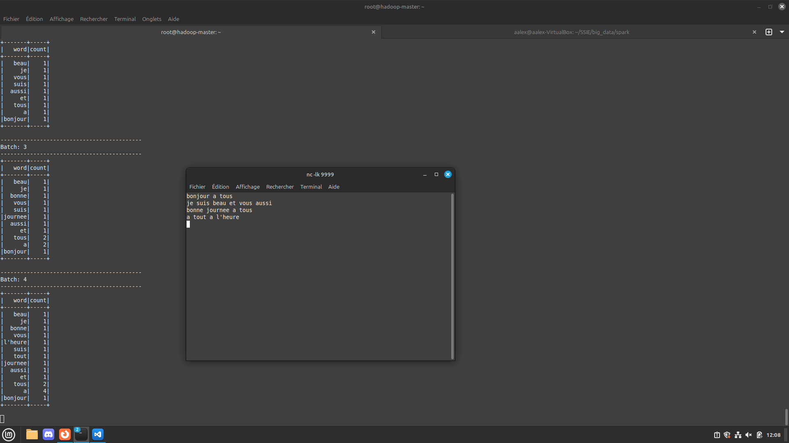

run ./start_docker.sh
```
it will:
    - run all dockers
    - copy all files
    - start and set up hadoop
    - open a terminal in hadoop-master
    - open a terminal with nc -lk 9999 in it 

when you kill the hadoop-master terminal 
it will remove all dockers
```
if ./start_docker.sh failed rerun it it will work


in hadoop-master 
```
    All exo_*.sh are in exo folder.

    All exo_*.sh 
        - remove the output
        - modify the path of the programe depend of the path of execution
        - call the programe with the good input  
        - print where the outout goes


    run ./exo_dracula.sh to do the exercice of wordcount
    see the result with:
        hadoop fs -cat sortie/part-00000
        hadoop fs -cat sortie/part-00001
        hadoop fs -cat sortieBis/part-00000
        hadoop fs -cat sortieBis/part-00001


    run ./exo_taller_tree.sh to do the exercice to find the taller tree
    see the result with:
        hadoop fs -cat taller_tree_output/part-00001

    run ./exo_circonference_tree.sh to do the exercice to find the higth circonference in each arrondissement
    see the result with:
        hadoop fs -cat circonference_tree_output/part-00000
        hadoop fs -cat circonference_tree_output/part-00001

    run ./exo_espece_tree.sh to do the exercice to get all espece and genre of trees
    see the result with:
        hadoop fs -cat espece_tree_output/part-00000
        hadoop fs -cat espece_tree_output/part-00001

    run ./exo_stream.sh to do the exercice to get all espece and genre of trees
    see the result in the terminal of hadoop-master
    you can out yours in the terminal named nc -lk 9999
    the programe take time to set up and it is not very reactive, let it time  

```
exemple of output of exo_stream.sh:



j'ai eu des problèmes avec wc_stream.py car Dstream est déprécié  
j'ai donc recodé un programe avec SparkSession  
et pour l'addresse IP ça marche que avec l'address du docker et pas @ip  
J'ai donc rajouter un script qui regarde l'adresse du docker et l'ecrit dans exo_stream.sh qui la donnera en argument a wc_stream.py  

